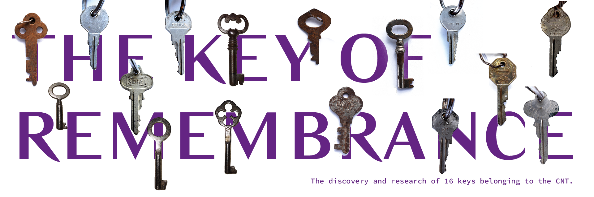
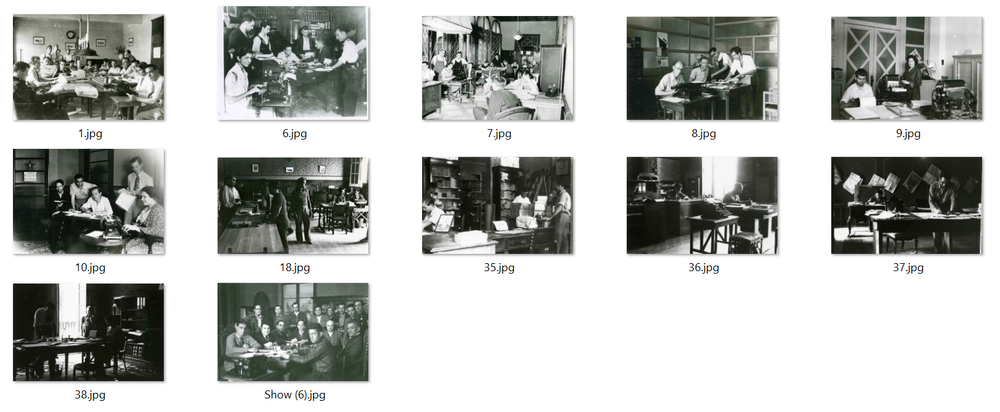
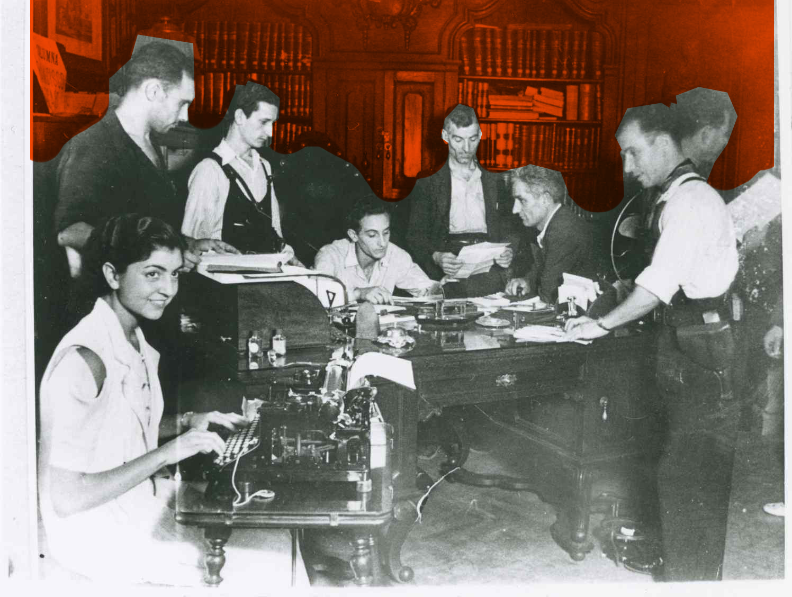
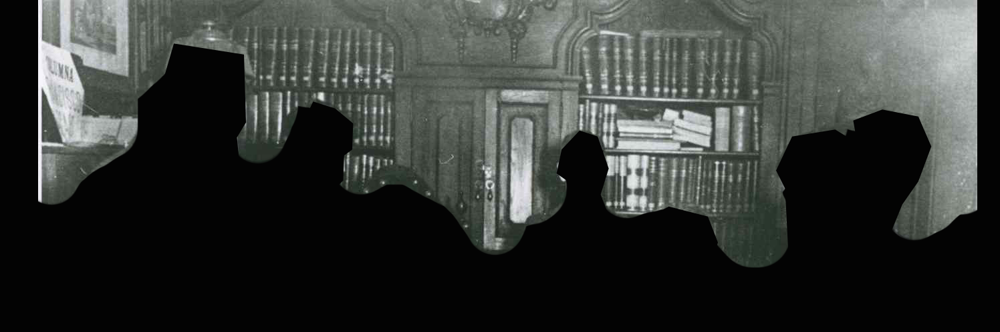
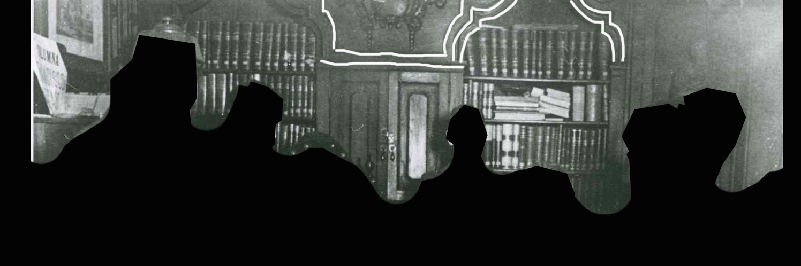
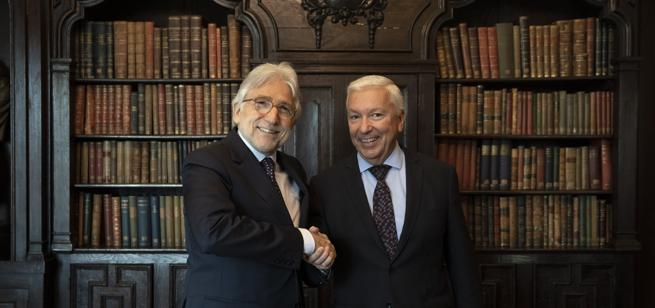
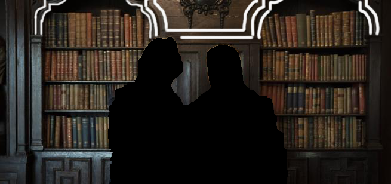

# The 16 Keys

### Table of Contents
1. [Artefact](#Artefact)
    1. [Metadata](#Metadata)
2. [Research](#Research)
3. [Transcoding](#Transcoding)
    1. [Transcoding No. 1](#Transcoding-no-1)
    2. [Transcoding Tool](#Transcoding-tool)
4. [Reflection](#Reflection)
5. [Outcome](#Outcome)
6. [Conclusion](#Conclusion)
7. [Bibliography](#Bibliography)

# Artefact
Sixteen keys scattered across a drawer that was yanked out suddenly from a CNT office in the heated fire of the Spanish Civil War, now confined in the safety of a cardboard box in the IISG, in Amsterdam. It was 1939, Barcelona. What did the keys open? What would they come to represent?

## Metadata
| Tag | Data |  
|--|--|
**IISG Call Number** | [IISG BG K21/985](https://search.iisg.amsterdam/Record/1109411)
| **Physical Description** | 16 keys
| **Type** | Object
| **Medium** | Tool/device
| **Materials** | Copper, Steel, Iron
| **Date** | prior to 1936
|| 16 keys: three separated; four held together with a twisted wire that comes through the holes at the top; another three held together with a ring of metal, and the last six are held all together in another ring of metal. There are 9 designs (how they are physically shapes) for the keys, some of which are repeated.

# Research

## The Starting Point
The starting point for researching items in the IISG archive was my cultural background and language. From the visits to the archive I found that they had an archive specified to the Spanish Civil War. Later, through researching I found out that this archive was actually for the CNT, a workers' union and one of the sides of the Civil War specifically.

Through the keywords "Spain" and "CNT" I found the box containing [16 keys and 16 stamps](https://search.iisg.amsterdam/Record/COLL00156).  
I found out that these keys were originating from CNT owned buildings and vehicles, many of which were stolen by the Fascist side, or rather legay taken as the winning side of the war. From there, I came to discover the legal battle taking place still today on these previous belongings of the CNT.

Photographs of the items at the archive:
     

### Articles on the stolen properties

  1. 1985: https://elpais.com/diario/1985/08/30/economia/494200810_850215.html
  2. 2005: https://www.lahaine.org/est_espanol.php/a-vueltas-con-el-patrimonio
  3. 2006: https://www.publico.es/politica/tribunal-avala-derecho-cnt-recuperar.html
  4. 2008: https://www.diariodeleon.es/articulo/espana/trabajo-cierra-cnt-devolucion-patrimonio-incauto-franco/20080301000000950755.html
  5. 2018: https://www.cnt.es/noticias/ochenta-anos-despues-cnt-sigue-exigiendo-la-recuperacion-de-su-patrimonio-historico/

### Articles on the CNT-FAI IISG archive

  1. https://elpais.com/diario/1982/01/19/ultima/380242807_850215.html
  2. https://www.foroporlamemoria.info/documentos/2004/cnt_falsa_072004.htm
  3. https://www.lamarea.com/2016/02/19/un-tesoro-libertario-en-el-pais-de-los-tulipanes/
  4. https://iisg.amsterdam/en/collections/browsing/collection-guides/spanish-civil-war

********
[Back to Table of Contents](#table-of-contents)
********

# Transcoding
The transcodings focused on the following question: "What is a key?".
This not only made translating the existing keys themselves, breaking down their physicality, but also bring out the metaphorical aspects, different  types of keys as well as the story behind these keys.  

## Transcoding No. 1
### Description
This first transcoding was a literal translation of what the keys possibly are. These are all hypothesised, based on research, given that the keys could not be analysed chemically.

### Methods
For this analysis, I had to base my theories on research. A lot of it was researching the materials of what different keys would be made of. This was based on researching what the keys were to begin with; a car key, the key of a lock of a furniture piece, the age of the key, if the key was stamped out as a copy, ... To know this, I researched the different shapes of the keys, writing on them or other symbols, and spoke to people who dealt with antiques and knew about older keys and locks.

Additionally, I measured half of them the one time I visited the IISG. Based on the measurements I took, and crossing this information with the proportion the keys have proportionally to one another based on a picture (see the [Metadata](#metadata) for the image), I was able to guess the missing measurements. I did the measuring on InDesign after proportionally resizing the images.

### Tools
Google, interviews, visual research based on previous knowlegde. Analysing images visually by zooming in, picture viewer. Indesign.

### Results
- Car keys - Steel
- Older keys - Iron
- Newer keys - Brass

## Transcoding No. 2
### Description
Being unable to go to the IISG archive due to the COVID-19 crisis meant that I had to work with the images of the keys that I took on a previous visit. From these, I am able to get a lot of detail as I intentionally took great close ups.
It is important to state this because it means that all the following transcoding and data is derived from a copy of the original item, a reproduction. The data is from the reproduction itself rather than the keys as objects.  

This particular transcoding focused on the numerical metadata of the photos of the keys, that is the EXIF data of the photo itself.

### Methods
In order to achieve this, I found online two tools that could provide me all the metadata on each image.

The first was [Image forensic](http://www.imageforensic.org/). From this, under the EXIF tab (exchangeable image file format) I was able to find the numerical data of each format for each image specifically. The Exchangeable Image File Format is a standard that specifies the formats for images, sound, and ancillary tags used by digital cameras, in this case providing metadata of the image as well as additional information.

Under the EXIF tab, I scrolled down to the numerical data of the "photo" section, rather than the camera and other settings. From this numerical data the photo can be recomposed.

### Tools
The tool I used for this was [Image forensic](http://www.imageforensic.org/).

### Results
  

## Transcoding No. 3
### Description
This particular transcoding focused around photo forensics. This means to analyse the visual aspects of the image based on a superficial way by looking over the image and cross-comparing to other images.

### Methods
After researching into photo forensics, I found this project that through analysing video footage and images, alongside recreating spaces in Augmented Reality, they were able to recreate a bombing that occurred in Douma, Syria and find out if Syrian President Bashar al-Assad was responsible for it. [Here you can see the investigation.](https://www.nytimes.com/interactive/2018/06/25/world/middleeast/syria-chemical-attack-douma.html)

This inspired me to conduct an investigation of my own, linking the keys to the objects they could have potentially belonged to, based off of a series of photographs that I collected from the IISG archive. These photographs were also sent from the same office that these keys came from, and most of these were taken within the offices of the [Fomento del Trabajo Nacional, in Barcelona](#Origin-of-the-items).

From the images I gathered, I chose only the photographs that were interiors of the Foment del Nacianal (Fomento del Trabajo Nacional, National Work/Labour Promotion), showing offices. We know the keys came in an office drawer.

### Tools
Google, photoviewer, Photoshop.

### Results
  
  *All images of the office interiors.*

  
  *In this image I highlighted the background furniture piece. It is a bookshelf with drawers and closets, a traditional 1800s office furniture piece. It stood out the most because it's permanence was most likely; it is a furniture piece that is antique and built into the space of the office itself.*

  
  *Detail of the furniture piece extracted.*

  
  *Key features of the furniture piece, highlighted, as to identify it in other pictures.*

  
  *Upon googling, I was able to find an official [website](https://www.foment.com/es/sobre-nosotros/sede-social/) that presented all the public rooms of the Foment del Treball Nacional. In that, I found this room was called "Historical Office of the General Secretary". I went on to google it, as well as googling general interiors of the building,and found this photograph.*

  
  *Here highlighted the same shapes that were identified in the photograph. The center piece between these two bookshelf sections also matches the one in the picture.*

  ********
  [Back to Table of Contents](#table-of-contents)
  ********

## Transcoding Tool
### Description
You might have made multiple coding tools during the semester. Or the transcoding tool might be part of a specific transcoding experiment itself. It's up to you to define the linear flow of the Readme. Just like the transcoding of media itself, the coding tool should be well documented. So if you are using a coding tool in your first experiment, include the documentation of the coding tool **before** you include the results, etc.

### Aims
Include the main aims or intentions behind making the tool, and what it is used for.

### Methods
This includes the coding languages, coding frameworks or libraries, and any platforms or webtools for example.   

### Results
The coding tool will vary a lot between different students. So depending on the use and type, you may include more or less documentation here.

### Source Links
Please include links to the tools, sources etc used during the coding. E.g. the resources used for making your coding tool.  

# Reflection
You might want to include a section about reflecting on the results of your coding and IMD experiments this semester. It can give additional context before reading the final outcomes below.

# Outcomes
This section will be different for each student, depending on how and what is formatted as a final result for the semester assignment. Nevertheless a clear written and documented outcomes is important. So give the appropriate subsections or formats to make this as thorough as possible.

### Outcome Links
Here you link to your final assignment outcomes. This could be a website, a video, etc etc. Please include links to the appropriate GitHub folder on your repository where your coding tool is stored.

This is the main way to access your IMD + Coding outcomes for the semester. So its very important that you check for bugs, troubleshoot hyperlink issues, embedded media issues etc. Please make sure you KNOW where each file you use is stored. E.g. If you migrated from Notion markdown into GitHub, its **VERY IMPORTANT** to know that Notion randomly stores images on an Amazon server. It changes those locations all the time. So if your main outcome or documentation is still grabbing those links, **its very likely** they might disappear before collectives. So please have all media and necessary files managed well in your own locations (online or github etc).   

# Conclusion
You might have a nice conclusive observation to share at the end :)

## Bibliography
Of course, as with all research work please include a good bibliography with links, and any references that were used or might give additional depth to the work.

<a name="footnote-1">**[1]**</a>: Look at this little referenced footnote over here. You can look up different text formats for referencing books, online articles, films etc.
